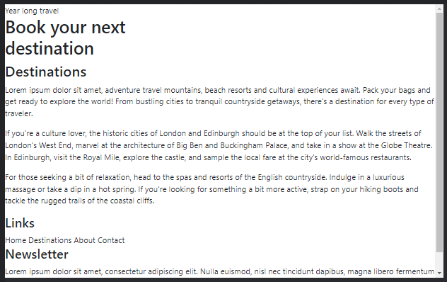
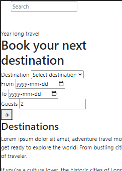
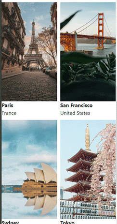
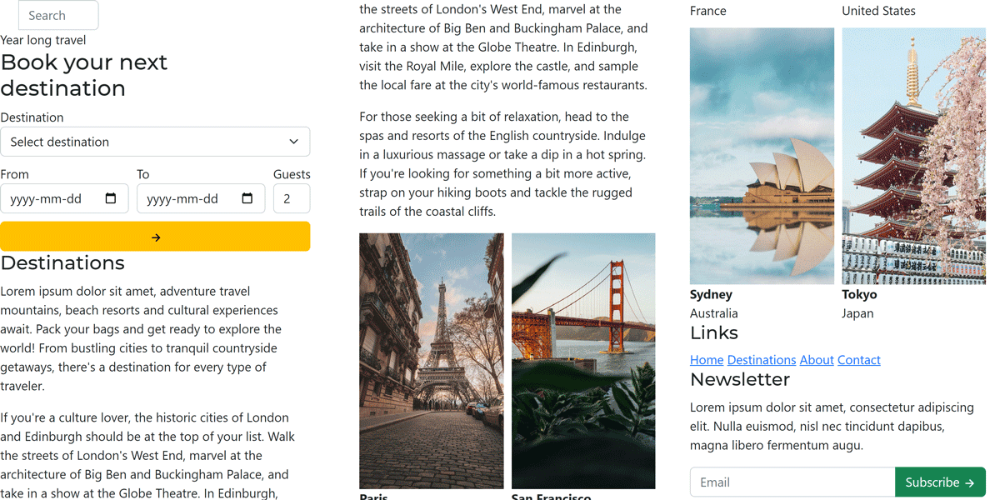
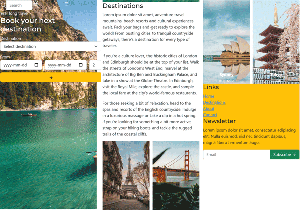
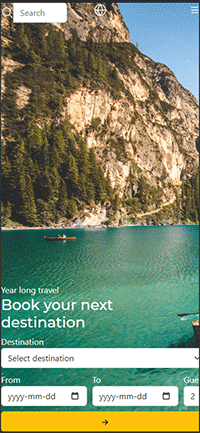
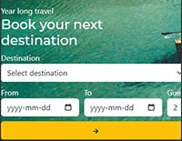
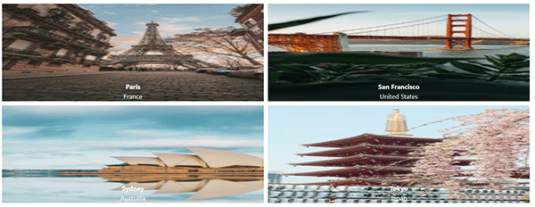
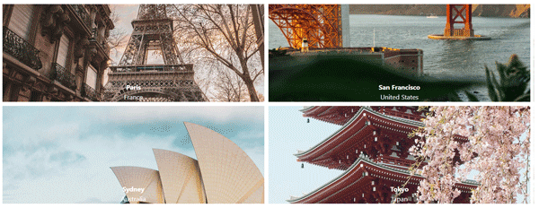

**Step 1: Analyze the design**

- Look at the provided screenshot and divide the design into three main sections: header, destinations, and footer. Then, let's divide each section into main elements.

| Header | Destinations (cropped) | Footer |
| --- | --- | --- |
|  |  |  |

**Step 2: Rebuild the general page structure in HTML.**

Let's ignore CSS at first. We'll start by creating the HTML structure for the page using the provided assets and the text we can see. I'll focus on the `<body>` tag and create the following structure with comments indicating what we'll put in each section:

```html
<body>
  <header>
    <div>
      <!-- Search -->
      <!-- Logo icon -->
      <!-- Menu icon -->
    </div>
    <div>
      <div>Year long travel</div>
      <h1>
        Book your next<br/>
        destination
      </h1>
      <!-- Booking form -->
    </div>
  </header>
  <section>
    <h2>Destinations</h2>
    <div>
      <p>
        Lorem ipsum dolor sit amet, adventure travel mountains, beach
        resorts and cultural experiences await. Pack your bags and get
        ready to explore the world! From bustling cities to tranquil
        countryside getaways, there's a destination for every type of
        traveler.
      </p>
      <p>
        If you're a culture lover, the historic cities of London and
        Edinburgh should be at the top of your list. Walk the streets
        of London's West End, marvel at the architecture of Big Ben and
        Buckingham Palace, and take in a show at the Globe Theatre.
        In Edinburgh, visit the Royal Mile, explore the castle, and
        sample the local fare at the city's world-famous restaurants.
      </p>
      <p>
        For those seeking a bit of relaxation, head to the spas and
        resorts of the English countryside. Indulge in a luxurious
        massage or take a dip in a hot spring. If you're looking for
        something a bit more active, strap on your hiking boots and
        tackle the rugged trails of the coastal cliffs.
      </p>
    </div>
    <div>
      <!-- Destinations -->
    </div>
  </section>
  <footer>
    <div>
      <h3>Links</h3>
      <div>
        Home
        Destinations
        About
        Contact
      </div>
    </div>
    <div>
      <h3>Newsletter</h3>
      <p>
        Lorem ipsum dolor sit amet, consectetur adipiscing elit. Nulla
        euismod, nisl nec tincidunt dapibus, magna libero fermentum augu.
      </p>
      <!-- Newsletter Form -->
    </div>
  </footer>
</body>
```

In some places, I've already added the appropriate headlines. Let's see what we've got.

<!--  -->


Now, we'll start working on each section separately.

**Step 3: Replace placeholders with appropriate HTML elements**

We've 6 areas that we need to substitute with the appropriate HTML elements:
- Search
- Logo icon
- Menu icon
- Booking form
- Destinations
- Newsletter form

Let's replace them one-by-one:

Search:
```html
<form method="get">
  
  <input type="text" placeholder="Search">
</form>
```

Logo icon:
```html

```

Navigation menu icon:
```html
<div>
  
</div>
```

Booking form:
```html
<form>
  <div>
    <label>Destination</label>
    <select>
      <option value="" selected disabled>Select destination</option>
      <option value="paris">Paris</option>
      <option value="tokyo">Tokyo</option>
      <option value="sydney">Sydney</option>
      <option value="san-francisco">San Francisco</option>
    </select>
  </div>
  <div>
    <label>From</label>
    <input type="date" placeholder="From">
  </div>
  <div>
    <label>To</label>
    <input type="date" placeholder="To">
  </div>
  <div>
    <label>Guests</label>
    <input type="number" value="2">
  </div>
  <div>
    <button type="submit">
      
    </button>
  </div>
</form>
```

Destinations:
```html
<div>
  
  <div>
    <strong>Paris</strong>
    <div>France</div>
  </div>
</div>
<div>
  
  <div>
    <strong>San Francisco</strong>
    <div>United States</div>
  </div>
</div>
<div>
  
  <div>
    <strong>Sydney</strong>
    <div>Australia</div>
  </div>
</div>
<div>
  
  <div>
    <strong>Tokyo</strong>
    <div>Japan</div>
  </div>
</div>
```

Newsletter form:
```html
<form>
  <input type="email" placeholder="Email">
  <button type="submit">
    Subscribe
    
  </button>
</form>
```

Also, let's use links in the footer and wrap them in a `<nav>` instead of a `<div>`:

```html
<h3>Links</h3>
<nav>
  <a href="">Home</a>
  <a href="">Destinations</a>
  <a href="">About</a>
  <a href="">Contact</a>
</nav>
```

Now, we should have something like this:

<!--  -->


**Step 4: Choose a layout for each section**

We need to identify all elements that need columns. In mobile view, we see 3 cases of just that:
- Bar at the top (topbar) (1 row, 3 columns)
- Booking form (3 rows, 3 columns)
- Destinations photos (2 rows, 2 columns)

Let's start adding `id` and `class` attributes to the HTML elements that we'll need to style and then create the necessary CSS rules.

```html
<div id="topbar">
  ...
</div>
```

```css
#topbar {
  display: grid;
  grid-template-columns: 1fr 1fr 1fr; /* 1 row with 3 columns */
}
```

For the booking form, I've added a `class` attribute to each `<div>`. Then, I've considered using `grid-template-columns` and `grid-template-rows`. But there's an alternative way that allows us to design a 3x3 grid visually - `grid-template-areas`. Let's try that:

```css
#book form {
  display: grid;
  /* 3x3 grid with named grid areas */
  /* 1st row: destination x 3 columns */
  /* 2nd row: 3 fields x 1 column */
  /* 3rd row: submit button x 3 columns */
  grid-template-areas:
    "destination destination destination"
    "from to guests"
    "submit submit submit";
}

#book form .destination-select {
  /* This is how we assign a grid area to each element */
  grid-area: destination;
}

#book form .from {
  grid-area: from;
}

#book form .to {
  grid-area: to;
}

#book form .guests {
  grid-area: guests;
}

#book form .submit {
  grid-area: submit;
}

#book form .submit button {
  width: 100%; /* So it fills the entire row */
}
```

Finally, for destinations 2x2 grid:
```css
.destinations {
  display: grid;
  grid-template-columns: 1fr 1fr;
  grid-template-rows: 1fr 1fr;
  gap: 10px; /* gap between rows and columns */
}
```

Ok, we have a problem. The images in the destinations section are way too large.

If we investigate the HTML, we'll see that they are in a grid layout, but they "spill over" outside of their containers. That's a special behaviour of images. Unless we limit their size, media elements will be displayed 1:1 to their actual size. Let's add this CSS rule to limit the images to the width of their containers:

```css
.destination img {
  width: 100%;
}
```

<!--  -->


That's more like it!

**Step 5: Add applicable Bootstrap classes**

Our buttons and fields are not styled yet. Let's add the necessary Bootstrap classes to make them look better.

Let's add classes:
- `form-control` to `input` elements
- `form-select` to `select` elements
- `btn` to `button` elements.

We can go even further and add:
- `btn-warning` to the Book button to make it yellow.
- `btn-success` to the Subscribe button to make it green.
- `input-group` on the search and newsletter forms to make sure the buttons are aligned correctly.

By now, we should have something like this:

<!--  -->


**Step 6: Add the most significant styles**

While our layout seems to be mostly right, we can easily spot some differences between our page and the original design:
- header size
- header background image
- header text color
- destinations text on top of the images
- footer background color
- navigation links in a list instead of a row

Let's go top to bottom.

Header:
```css
header {
  /*
    A way to use an image in a background. It's an absolute URL,
    so for it to work you'll nedd to have a running web server.
  */
  background-image: url('/images/header.jpg');

  /* if we Google "css fill background with image", we find this: */
  background-size: cover;

  /* make the text white */
  color: white;

  /* make the element take up the entire height of the screen */
  height: 100vh;
}
```

Laying out an item on top of an another item seems to be quite tricky. Let's see if we can find a solution.

If we Google "css text on top of image", we find this a method using `relative` and `absolute` positioning. Let's try that:

```css
.destination {
  /* Placement of child elements will be relative to this element */
  position: relative;
}

.destination .location {
  /* Place the element at the bottom of the parent element (.destination) */
  position: absolute;
  bottom: 0;

  /* Make it take up the entire width of the parent */
  width: 100%;

  /* White, centered text */
  color: white;
  text-align: center;
}
```

This is not the only way to do this. We could also use `display: grid` and placing both image and text in the same grid cell. But this is a good example of how we can use Google to find solutions to our problems.

Now, let's fix the footer background color.

We don't know what color is used in the original design. But we can notice that it's yellowish and it seems to be the same color as the Book button. We can use Developer Tools to check what is the exact button color. It seems to be `#ffc107`. Let's use that:

```css
footer {
  background-color: #ffc107;
}
```

What about navigation links? Links, by default are display in an inline fashion. That's why they are displayed in a row. To change this behaviour and make it resemble `div` elements, we can change its `display` type:

```css
footer nav a {
  display: block;
}
```

Now each link has its own line as if it was a `div` element, which is displayed as a block.

After that, our mobile page should look like this:

<!--  -->


**Step 7: Identify key layout and spacing problems in the design**

We have made a lot of progress, but there are still some issues with our page:
- items in the topbar are not aligned correctly
- the header form is not aligned at the bottom
- some elements and headlines are too close to each other

Let's fix them one by one.

First, **let's fix the topbar**.

We'd like the search bar to be on the left, the logo straight in the middle and the menu icon hugging the right side.

We can accomplish that by giving instructing each element to align to a different side. First, let's add wrapper `div` elements around the logo and menu icon:

```html
<div id="topbar">
  ...
  <div id="logo">
    
  </div>
  <div id="menu">
    
  </div>
</div>
```

Now, we can use `display: flex` or `text-align` to align the elements correctly. I'll use `display: flex` as it's leaves us with more options if we want to change the layout later on.

```css
#logo {
  /* Align the logo to the center of its cell */
  display: flex;
  justify-content: center;
}

#menu {
  /* Align the menu icon to the right of its cell */
  display: flex;
  justify-content: flex-end;
}

```

Now our elements are aligned correctly.

<!--  -->


Next, let's fix the **header form**. We can see that the form is not aligned at the bottom. Since this layout does not require multiple columns, we can use `flexbox` to align the elements correctly.

In essence, we're trying to achieve this:

<!--  -->


This can be done by adding the following to the `header.css`:

```css
header {
  /* ... */
  display: flex;
  flex-direction: column;
  justify-content: space-between;
}
```

Great! Now our header form is aligned correctly.

<!--  -->


Finally, let's fix the **spacing**.

We can see that the elements are too close to each other. We can fix that by adding some `padding` (inner spacing) and `margin` (outer spacing) to the elements.

```css
#topbar {
  /* ... */
  padding-top: 10px;
}

header {
  /* ... */
  padding-bottom: 20px;
}
```

```css
#destinations {
  padding-top: 20px;
  padding-bottom: 20px;

  /* the same can be achieved by using the shorthand: */
  padding: 20px 0;
}
```

What about padding on the left and right? While we could add it right now, it's better to leave side-to-side spacing for later - when we'll be working on the table and desktop versions of the page.

Before we move on to the next step, let's also fix the issue with the **booking form** as it seems to not fit into the page 😣. It cuts off the "Guests" field:

<!--  -->


First, we need to identify the exact issue.

I'm viewing the page on the iPhone Xs view (375x812px resolution). If open up Developer Tools and try inspecting the form, I see this:

<!--  -->


Form is 375px wide, but the screen is 375px wide as well. So why is the form not fitting?

The answer is that the grid cells are not of equal size. They allow the content to grow and shrink as needed. And since the "From" and "To" fields try to take up space, the last grid column with the "Guests" field is left with close to no space.

We can fix that by making the grid cells equal in size.

```css
#book form {
  grid-template-columns: 1fr 1fr 1fr;
}
```
Ok, that doesn't change anything. When a naive solution fails, let's try searching for help online. When Googling "css grid equal columns", the first result points to [Stack Overflow](https://stackoverflow.com/questions/47601564/equal-width-columns-in-css-grid).

It presents a solution:

```cs
grid-auto-columns: minmax(0, 1fr);
grid-auto-flow: column;
```

and "if you really need the columns to be the exact same width you should use:"

```css
grid-template-columns: repeat(3, minmax(0, 1fr));
```

After a bit of tinkering, we find out that the minimal solution is:

```css
#book form {
  grid-template-columns: repeat(3, minmax(0, 1fr));
  grid-auto-flow: column;
}
```

Now all the columns are equal in size and the form fits into the page.

**Step 8: Test the page on different resolutions**

Before we move on to adding more challenging styles, let's test our page on different resolutions. It's best to nail down the layout on all screen sizes before we move on to adding more styles.

If we change the Dimensions to `1920x1080` (a common desktop resolution), we notice a two large issues:
- our page content is not centered
- destinations images are way too large

As mentioned in task hints, we can use Bootstrap containers to center the page content. Containers, in Bootstrap terminology, are elements that center the content, limit its width and add some padding on the sides. Containers have various sizes, such as `container-sm`, `container-md`, `container-lg` and so on. Let's try using `container-md`.

Any element with the `container-md` class will be centered and have a maximum width of `720px`. Let's wrap each section content with a container:

```html
<body>
  <header>
    <div class="container-md">
      <div id="topbar">
        <!-- topbar content -->
      </div>
      <div id="book">
        <!-- text and booking form -->
      </div>
    </div>
    <section id="destinations">
      <div class="container-md">
        <!-- destinations content -->
      </div>
    </section>
    <footer>
      <div class="container-md">
        <!-- footer content -->
      </div>
    </footer>
  </header>
</body>
```

That seems to break our header size. That's probably because the header flexbox affects the container and not the inner elements - `#topbar` and `#book`. Let's fix that by moving our flexbox styles from `header` to the container:

```css
header > .container-md {
  display: flex;
  flex-direction: column;
  justify-content: space-between;

  /* expands our container to take up all the available space offered by the header */
  height: 100%;
}
```

That's better. What should we do about **the destinations images**? We can see that they are too large. We can fix that by limiting their dimensions. Their width dynamically changes based on the resolution, so we should probably not touch that. Let's try limiting their height to `200px`:

```css
.destination img {
  max-height: 240px;
  width: 100%; /* a line from earlier */
}
```

That has solved this issue, but now these images look distorted:

<!--  -->


Let's Google "css do not stretch image". The first result points to [Stack Overflow](https://stackoverflow.com/questions/11757537/css-image-size-how-to-fill-but-not-stretch). The suggested solution has 3 lines:

```css
object-fit: cover;
width: 50px;
height: 100px;
```

We want our image to have a dynamic height and width, so let's try only using the first line:

```css
.destination img {
  object-fit: cover;
  max-height: 240px;
  width: 100%;
}
```

Did it work?

<!--  -->


Yes! Now the images are not distorted and they are not too large.

We've fixed the glaring issues. Before we proceed further, let's **resize back down to mobile** and tablet resolutions and check if our changes didn't break anything.

Nope, everything seems to be working fine 🎉.

Let's refresh our memory with the desktop resolution screenshot.

While we still have quite a few differences, let's not get overwhelmed. Just like with the mobile view, we'll **tackle layout issues first** and then move on to element-level styling.

Here are the layout changes we should apply to the desktop view:
- topbar should contain 2 navigation links in top right corner
- the booking form should fit into a single row
- destinations paragraphs should be split into 3 columns
- destinations photos should be combined into a single 4-column row
- footer should be split into 2 columns

We'll start with the **topbar**. We can add the links in the `#menu` `div`:

```html
<div id="menu">
  <nav>
    <a href="">Destinations</a>
    <a href="" class="btn btn-light">Sign in</a>
  </nav>
  
</div>
```

As we saw in the screenshot, Sign in link should be styled as a button. And if we check the [Bootstrap documentation](https://getbootstrap.com/docs/5.2/components/buttons/), we can see that we can do that by adding the `btn` and `btn-light` (for its light background color) classes to the link.

Now we have the links, but we should make sure that these links are not visible on small screens and that the menu icon is not large screens. We could use media queries - CSS rules that apply only to a particular range of resolutions (or device types). But in this case, we can try out using Bootstrap's [responsive utilities](https://getbootstrap.com/docs/5.2/utilities/display/) to do that. These are Bootstrap classes that already have media queries built in.

To hide the menu icon on large screens we can use the `d-md-none` class. Read it as "display of medium size - none".

At the same time, to hide the links on small screens, we'll need to use 2 classes:
- `d-none` - hides the element on all screen sizes
- `d-md-block` - starting with medium displays, display the element

It should look like this:

```html
<div id="menu">
  <nav class="d-none d-md-block">
    <a href="">Destinations</a>
    <a href="" class="btn btn-light">Sign in</a>
  </nav>
  
</div>
```

Let's proceed with the **booking form**. Right now it's split into 3x3 grid:

```css
grid-template-areas:
  "destination destination destination"
  "from to guests"
  "submit submit submit";
```

We need it to have a single row with 5 columns:

```css
grid-template-areas:
  "destination from to guests submit";
```

But if we'd apply that change, our form would no longer look right on mobile. We need to make sure that the form adopts this layout only on tablet/desktop resolutions.

When should we consider a screen to be large? Let's say that any screen with a width of `768px` or more is large. Why `768px`? In fact, we could use a wide range of values, such as `800px`, `1024px` or `1200px`. But `768px` is a common [breakpoint](https://getbootstrap.com/docs/5.3/layout/breakpoints/) used by Bootstrap, so let's stick with that, though it's not a hard rule.

Let's add a media query to our `header.css` file:

```css
@media (min-width: 768px) {
  #book form {
    grid-template-areas:
      "destination from to guests submit";
  }
}
```

We can see that the form now fits into a single row. Let's move on to the **destinations** section.

Right now, all destination paragraphs are in a single column. We need to split them into 3 columns. We can do that by adding the following rules to the `destinations.css`:

```css
@media (min-width: 768px) {
  #destinations .description {
    display: grid;
    grid-template-columns: 1fr 1fr 1fr;
    gap: 20px;
  }
}
```

Let's move on to the **destinations photos**. We can fit all 4 photos into a single row by adding the following into the same media query:

```css
@media (min-width: 768px) {
  .destinations {
    grid-template-columns: repeat(4, 1fr);
    grid-template-rows: 1fr;
  }
}
```

It's important to note that `.destinations` already inherits the `display: grid` and `gap: 10px;` from the mobile view. We only need to change the `grid-template-columns` and `grid-template-rows`.

Finally, let's move on to the **footer**. We need to split it into 2 columns. We can do that by adding the following rules to the `footer.css`:

```css
@media (min-width: 768px) {
  footer {
    display: grid;
    grid-template-columns: 1fr 1fr;
    gap: 20px;
  }
}
```

That seems to break the container. Let's apply these rules to the container instead:

```css
@media (min-width: 768px) {
  footer > .container-md {
    display: grid;
    grid-template-columns: 1fr 1fr;
    gap: 20px;
  }
}
```

Once that's done, let's resize back down a tablet and then to a mobile view. Everything seems to be working fine. We can proceed to element-level styling.

**Step 9: Element-level styling (major)**

While everything seems to be more or less in the right place, we see that there are still quite a few differences between our design and the screenshot. Let's tackle them one by one.

i. header image should be pushed up
ii. topbar should be larger
iii. search bar should be transparent
iv. header should use a different font
v. header heading text should be larger
vi. destination photos should be larger on the desktop
vii. destination names should use custom fonts
viii. footer links should be black
ix. we should have more padding around destinations and footer sections

That's quite a lot of changes.

i. Let's start with the **header image**. We can see that it's not aligned in the same way as we see it in the screenshot. If we search for "css how to move background image", we find out that `background-size` property could be of help. After a bit of tinkering, we find out that the following value aligns the image in the same way as in the screenshot:

```css
header {
  background-position: center;
}
```

ii. The topbar seems to be too small. We can add some inner `padding` (inner buffer space around the edges), and adjust the height of the links:

```css
#topbar {
  padding-top: 20px;
  padding-bottom: 20px;
  /* or padding: 20px 0; */
}

#menu nav a {
  /* higher lines */
  line-height: 40px;
}
```

iii. The search bar should be transparent. We can add `search-field` id attribute to the input element and then add the following rule to `header.css`:

```css
#search-field {
  background-color: transparent;
  border: none;
}
```

iv. Header should use a different font. In the task hints, it's mentioned that we have 2 additional fonts - "Montserrat" and "Dancing Script". These fonts are already incldued in the `<head>` section of our `index.html` file:

```html
<link
  href="https://fonts.googleapis.com/css?family=Dancing+Script&family=Montserrat:400,700&&display=swap"
  rel="stylesheet"
/>
```

This means that we can use the `Dancing Script` and `Montserrat` fonts in our CSS files. If we search for these fonts online, we can find out that `Montserrat` is the font used in the header screenshot.

Let's add the following rule to `header.css`:

```css
header {
  font-family: "Montserrat";

  /* or, we can provide more fallback font options if for some reason the font fails to load */
  font-family: "Montserrat", Helvetica, Arial, sans-serif;
}
```

v. Header heading should be larger. We can add the following rules to `header.css`:

```css
header h1 {
  font-size: 64px;
  font-weight: bold;
}
```

vi. Destination photos should be larger on the desktop

The added `max-height` rule for the `.destinations img` selector works well when images are in the 2x2 grid. But for the desktop view, we don't need this size limitation. Let's incorporate the following rule to the `destinations.css` file:

```css
@media (min-width: 768px) {
  .destinations img {
    max-height: none;
  }
}
```

vii. Destination names should use custom fonts

We can use the `Dancing Script` font for the destination names. Let's add the following rule to the `destinations.css` file:

```css
.destination .location strong {
  font-family: "Dancing Script";
  font-size: 2rem;
}

.destination .location .country {
  /* the country seems to be using the same font as the header */
  font-family: "Montserrat";
  font-size: 14px;
}
```

viii. Footer links should be black.

```css
footer nav a {
  color: black;
}
```

ix. We should have more padding around destinations and footer sections.

```css
#destinations {
  padding-top: 60px;
  padding-bottom: 60px;
}

footer {
  padding-top: 60px;
  padding-bottom: 60px;
}
```

Now, we have a design that looks quite similar to the screenshot.

<!--  -->


**Step 10: Element-level styling (minor)**

At this point, we've done most of the heavy lifting. There are still a few tricky visually noticeable parts left.

Topbar:
i. fade effect from the top
ii. white placeholder text ("Search")
iii. round "Sign in" button
iv. white "Destiantion" link
v. white border at the bottom

Booking:
i. fade effect from the bottom
ii. uppercase, bold "Year long travel"
iii. aligned search button

Destinations:
i. Use of emphasis and bold text in paragraphs
ii. photos: fade effect from the bottom
iii. photos: round corners (all for 2x2 grid, first and last for 1x4 grid)
iv. photos: padding at the bottom
v. slightly darker country names

These steps are a bit more advanced yet quite minor to the final design. We'll leave them as an exercise for you to try out. If you get stuck, you can always check out the solution source code.

**Step 11: Additional accessibility and application of best practices**

We still can do a few things to make our website more accessible and to apply best practices.

i. Add `aria` attributes to `form` fields
ii. Add `for` attribute to labels and poitn them to input fields
iii. Add fallbacks to font-family rules
iv. Add `alt` attributes to images
v. Add `title` attributes to links
vi. Add `#destinations` to the "Destinations" link, so it scrolls to the destinations section
vii. Ensure there are styles for `:focus` and `:hover` states for all interactive elements
viii. Add `autocomplete` attribute to `form` fields.

Best practices:
i. Do not use `destination` class for a destination field in the form and for the destinations section. This would result in a lot of confusion and bugs.
ii. Add `name` for all `form` fields.
iii. Do not apply styles to HTML elements directly. Use ids and classes instead.
iv. Add `required` attribute to required form fields.
v. Add validation to the `guest` field (for example, it could be a number between 1 and 10).
vi. Use CSS variables for colors, fonts and other values that are used in multiple places.
vii. Consider using CSS variables for most pixel values (such as `padding`, `margin`, etc.) to make sure they're a multiple of some base value (such as 8px or 10px).
viii. Add meta fields for social media sharing.
ix. Do not apply styles to Bootstrap classes directly. Use custom ids and classes instead.

**Step 12: Pixel pushing (optional)**

This is absolutely not necessary for this task. But if you want to make your design pixel perfect, you can use a browser's extension, such as [PixelParallel](https://chrome.google.com/webstore/detail/pixelparallel-by-htmlburg/iffnoibnepbcloaaagchjonfplimpkob) or [PerfectPixel](https://chrome.google.com/webstore/detail/perfectpixel-by-welldonec/dkaagdgjmgdmbnecmcefdhjekcoceebi) for Chrome. It allows overlaying an image on top of a design and then adjusting the design until it matches the image.
